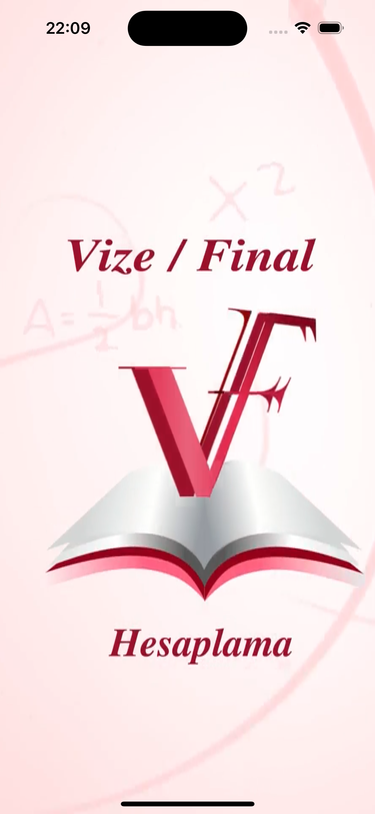
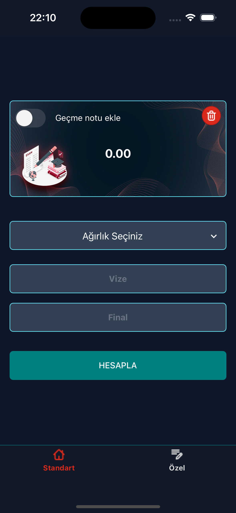
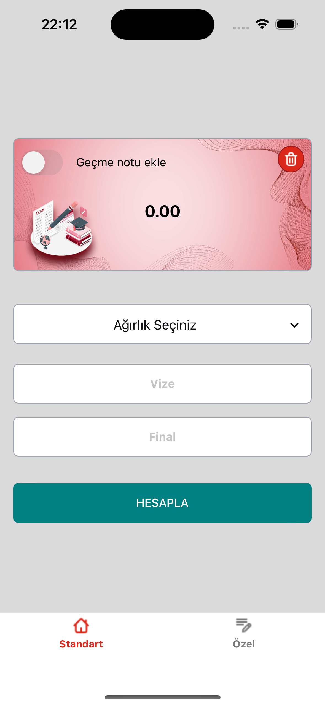
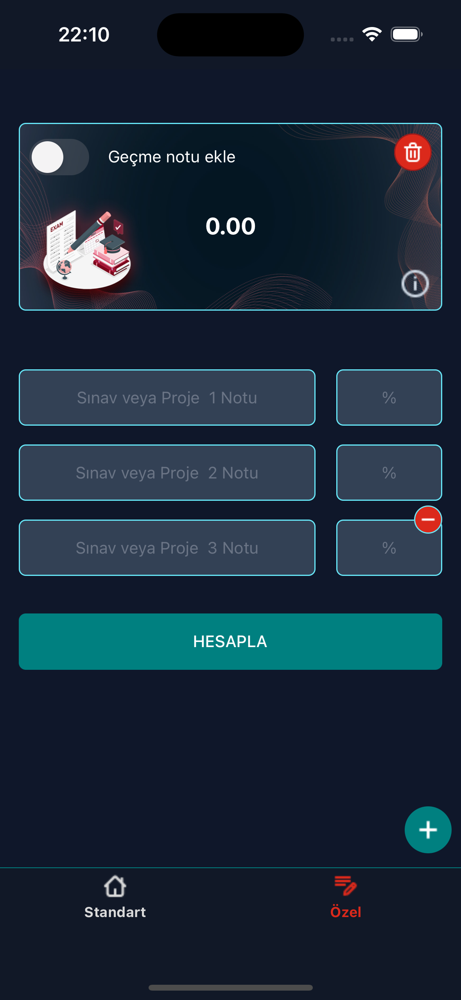
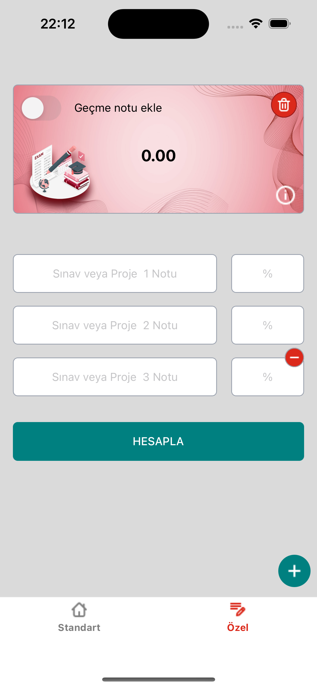
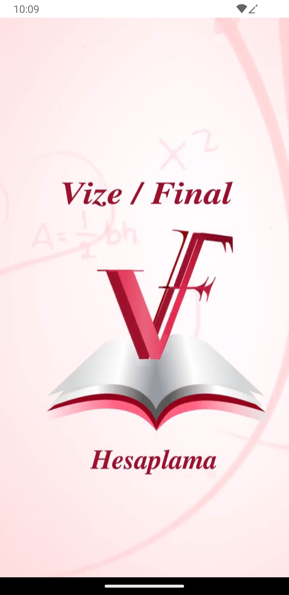
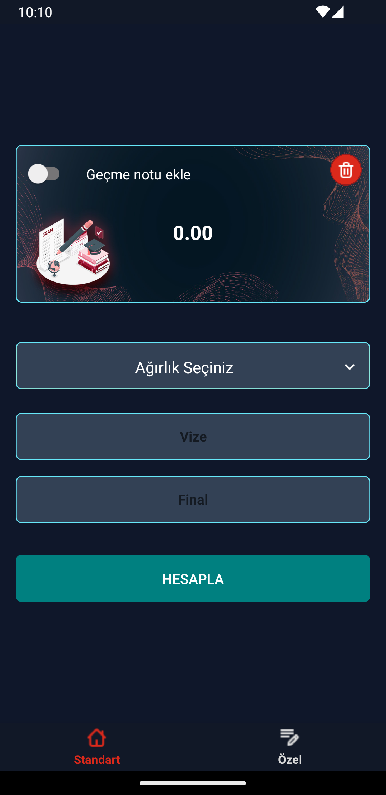
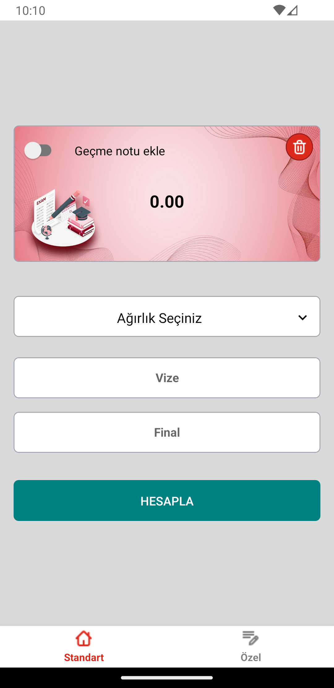
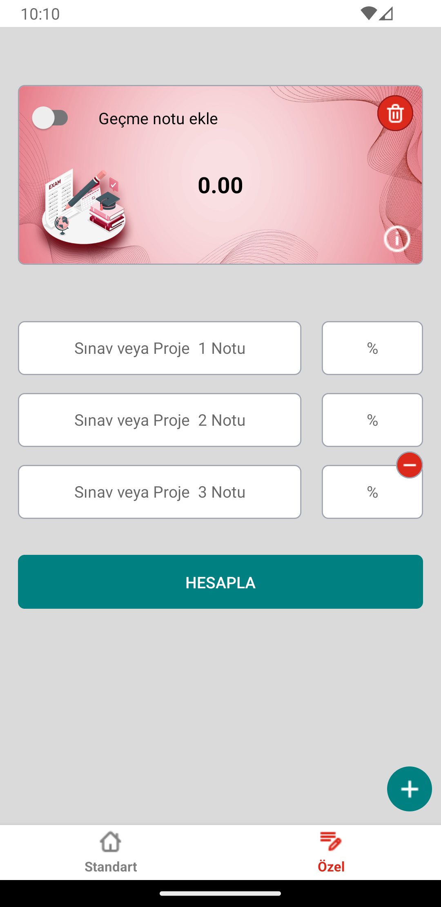
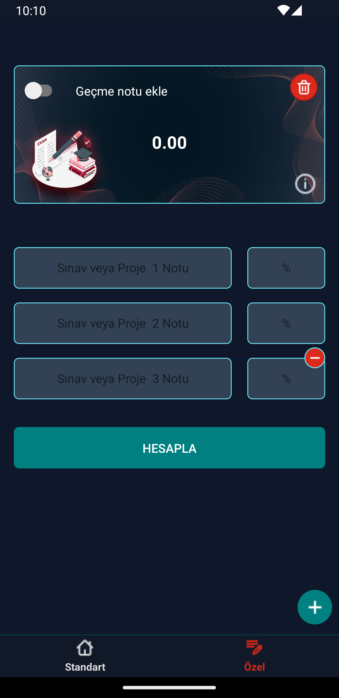

# Vize Final App

## Packages Used

- [React Navigation](https://reactnavigation.org/)
- [React Native Vector Icons](https://github.com/oblador/react-native-vector-icons)
- [React Native Reanimated](https://github.com/software-mansion/react-native-reanimated)
- [Moti](https://github.com/nandorojo/moti)
- [Nativewind](https://github.com/nativewind/nativewind)
- [Tailwindcss](https://github.com/tailwindlabs/tailwindcss)
- [React Hook Form](https://github.com/react-hook-form/react-hook-form)
- [Zod](https://github.com/colinhacks/zod)
- [React Native Gesture Handler](https://github.com/software-mansion/react-native-gesture-handler)

# Görseller

## Uygulama Varlığı

## ios

  

    
  

  

    
  

  

    
  

  

    
  

  

    
  

## android

  

    
  

  

    
  

  

    
  

  

    
  

  

    
  

